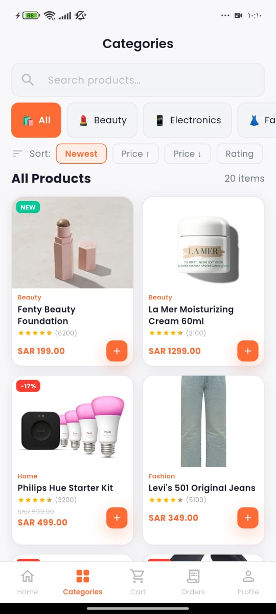
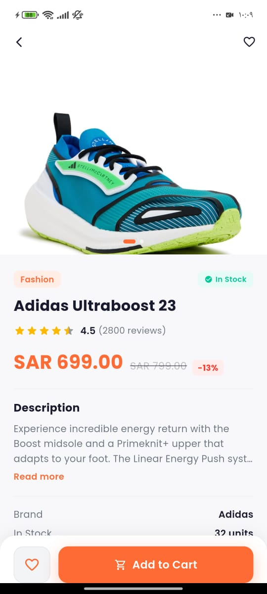
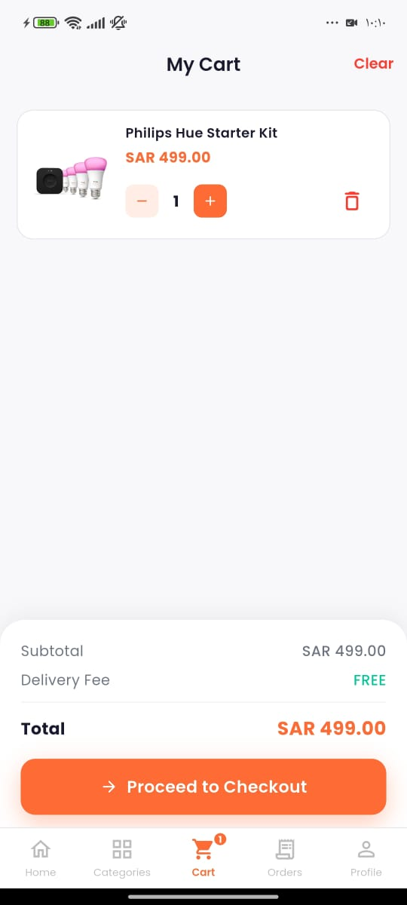
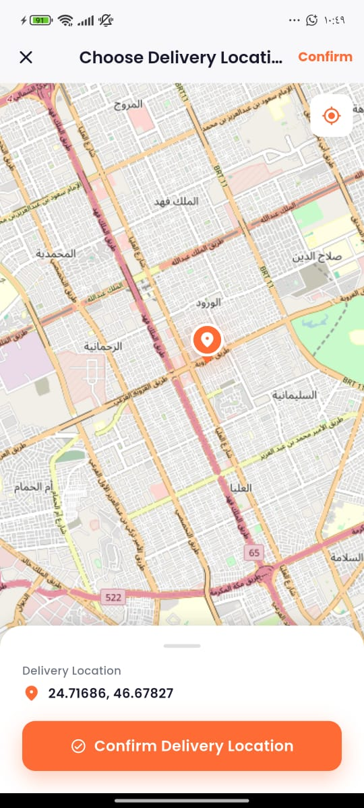
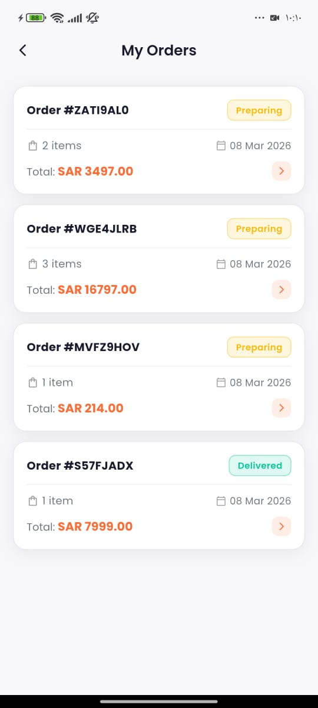

# 🛒 SwiftCart — Flutter E-Commerce App

A production-ready e-commerce mobile application built with Flutter,
featuring Clean Architecture, Firebase backend, and a beautiful UI.


## ✨ Features

- 🔐 **Authentication** — Email, Google Sign-In, Phone OTP
- 🏠 **Home** — Banner carousel, categories, featured & new products
- 🔍 **Search & Filter** — Search products, filter by category, price, rating
- 📦 **Product Detail** — Image gallery, reviews, similar products
- 🛒 **Cart** — Offline-first cart with Hive, real-time updates
- 📍 **Location** — Free OpenStreetMap map picker for delivery
- 💳 **Checkout** — Multiple payment methods, order summary
- 📋 **Orders** — Order history, real-time status tracking
- 🌙 **Dark Mode** — Full dark/light theme support
- 🌍 **Localization** — Arabic & English (RTL support)

## 📸 Screenshots

| Home | Categories | Product |
|------|------------|---------|
|  |  |  |

| Cart | Map Picker | Orders |
|------|------------|--------|
|  |  |  |

## 🏗️ Architecture
```
lib/
├── core/               # Theme, routing, network, localization, widgets
├── data/               # Models, datasources, repository implementations
├── domain/             # Entities, repository contracts, use cases
└── presentation/       # Screens + Riverpod providers (feature-based)
```

Clean Architecture with strict layer separation:
- **Presentation** → **Domain** ← **Data**
- `Either<Failure, T>` return type on all repository methods
- Zero framework dependencies in domain layer

## 🛠️ Tech Stack

| Layer | Technology |
|-------|-----------|
| UI Framework | Flutter 3.x |
| State Management | Riverpod + Freezed |
| Navigation | GoRouter |
| Backend | Firebase (Auth, Firestore, Storage) |
| Local Storage | Hive |
| Maps | OpenStreetMap (flutter_map) — Free |
| HTTP Client | Dio |
| Image Loading | CachedNetworkImage |
| Code Generation | build_runner, Freezed, JsonSerializable |

## 🚀 Getting Started

### Prerequisites
- Flutter SDK 3.x
- Dart SDK 3.x
- Firebase project

### Setup

**1. Clone the repository**
```bash
git clone https://github.com/YOUR_USERNAME/swiftcart.git
cd swiftcart
```

**2. Install dependencies**
```bash
flutter pub get
```

**3. Firebase setup**
```bash
# Install FlutterFire CLI
dart pub global activate flutterfire_cli

# Connect to your Firebase project
flutterfire configure
```

**4. Generate code**
```bash
dart run build_runner build --delete-conflicting-outputs
```

**5. Run the app**
```bash
flutter run
```

### Firebase Services Required
- ✅ Authentication (Email, Google, Phone)
- ✅ Firestore Database
- ✅ Storage

> **Note:** `firebase_options.dart` and `google-services.json` are excluded
> from the repo. You must run `flutterfire configure` with your own Firebase project.

## 📁 Project Structure
```
swiftcart/
├── lib/
│   ├── core/
│   │   ├── constants/      # Colors, strings, app constants
│   │   ├── localization/   # EN + AR translations
│   │   ├── network/        # Dio client + interceptors
│   │   ├── routing/        # GoRouter configuration
│   │   ├── theme/          # Material 3 light + dark themes
│   │   ├── utils/          # Failures, validators, extensions
│   │   └── widgets/        # Shared reusable widgets
│   ├── data/
│   │   ├── datasources/    # Remote (Firestore) + Local (Hive)
│   │   ├── models/         # Freezed models with Firestore mapping
│   │   └── repositories/   # Repository implementations
│   ├── domain/
│   │   ├── entities/       # Pure business objects
│   │   ├── repositories/   # Abstract repository contracts
│   │   └── usecases/       # Single-responsibility use cases
│   └── presentation/
│       ├── auth/           # Login, Register, OTP screens
│       ├── cart/           # Cart + Checkout screens
│       ├── categories/     # Category browse + filter
│       ├── home/           # Home screen + banner
│       ├── maps/           # OpenStreetMap location picker
│       ├── orders/         # Order history + detail + success
│       ├── product/        # Product detail screen
│       └── profile/        # Profile + settings
├── lib/scripts/            # Firestore seed script
├── firestore.rules         # Firestore security rules
└── pubspec.yaml
```

## 🔒 Security

- Firestore rules enforce user-scoped data access
- Auth tokens injected via Dio interceptor
- Service account key excluded from version control
- All secrets in `.gitignore`

## 📄 License

MIT License — feel free to use for portfolio or learning purposes.

---

Built with ❤️ using Flutter & Firebase
